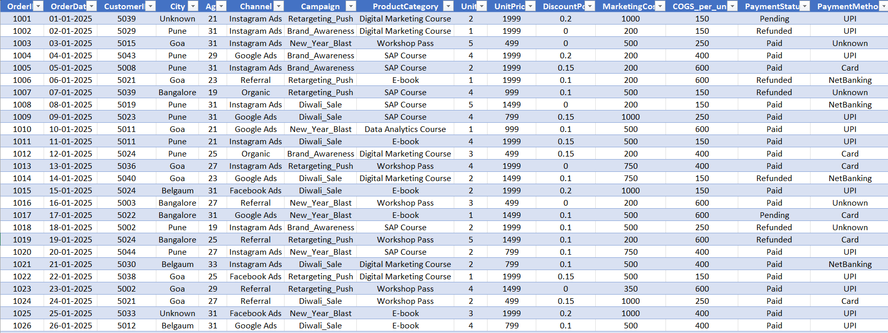
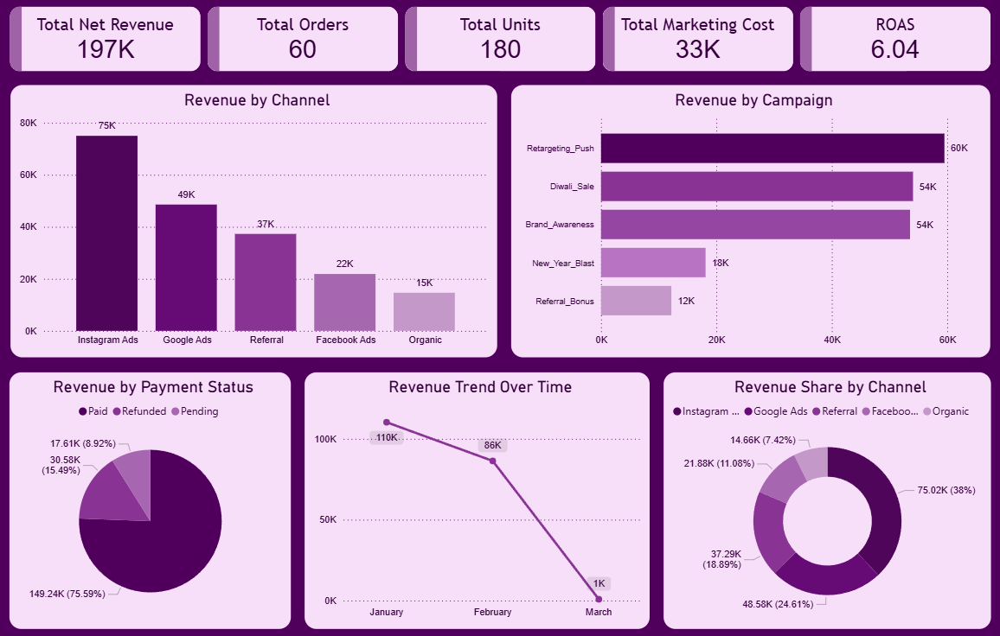
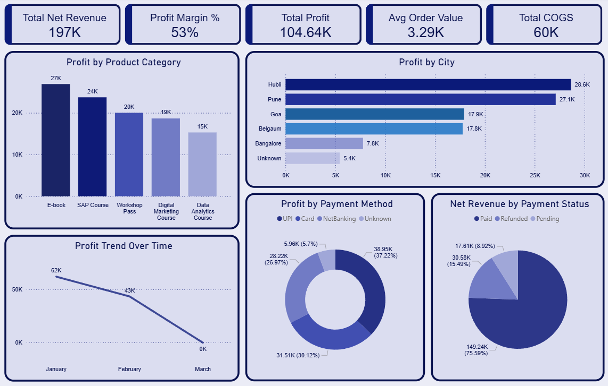

# Marketing Finance Performance Analytics – Power BI Dashboard

## Project Overview

Marketing teams invest heavily in campaigns, but understanding whether those campaigns actually generate profitable results is a major business challenge.
This project analyses marketing campaign performance and financial outcomes to uncover insights related to revenue generation, profitability, and marketing efficiency.

The analysis combines Python-based data cleaning with Power BI dashboards to transform raw marketing and financial data into actionable business insights.

The final solution includes two interactive dashboards:

- Marketing Campaign Performance Dashboard – evaluates campaign effectiveness and marketing ROI
- Financial Profitability Analysis Dashboard – analyzes revenue, costs, and profitability
   
These dashboards help stakeholders understand which campaigns perform well, where money is being spent, and how marketing activities influence overall profitability.

---

## Executive Summary

This project analyzes marketing campaign performance alongside financial outcomes to evaluate not just revenue generation, but whether marketing investments translate into profitable growth.

The analysis reveals that while certain channels such as Instagram Ads and retargeting campaigns drive a significant share of revenue, profitability is influenced by multiple factors including marketing costs, discounting strategies, and product-level margins.

A key finding is that high revenue does not always indicate high profitability. Some campaigns and channels contribute strongly to revenue but require careful cost and discount management to maintain healthy margins.

Additionally, performance varies across cities and product categories, indicating that marketing effectiveness is not uniform and requires targeted optimization rather than a one-size-fits-all approach.

By combining marketing and financial perspectives, this project enables stakeholders to:

- Evaluate marketing effectiveness based on profitability, not just revenue
- Identify high-performing and cost-efficient channels
- Understand the relationship between marketing spend, pricing, and profit
- Optimize campaign and product strategies for sustainable growth

Overall, the analysis shifts focus from campaign performance tracking to profitability-driven marketing decisions.

---

## Business Context

Organizations run multiple marketing campaigns across digital channels such as social media, search ads, referrals, and organic traffic. While these campaigns drive customer acquisition, companies must continuously evaluate:

- Which campaigns generate the highest revenue
- Whether marketing investments produce profitable returns
- Which channels drive the most orders
- How discounts and marketing costs affect profitability

By combining marketing and financial data, this project demonstrates how analytics can help businesses optimize campaign strategy, marketing spending, and revenue performance.

---

## Business Objective

The key objectives of this analysis are:

- Evaluate marketing campaign effectiveness
- Analyze revenue generated across marketing channels
- Measure Return on Advertising Spend (ROAS)
- Understand customer purchasing behavior
- Identify profitable products and locations
- Analyze profit trends and financial performance
- Provide actionable recommendations to improve ROI

---

## Dataset Preview

Below is a preview of the dataset used in the analysis.



---

## Dataset Information

The dataset contains marketing campaign, customer, and transaction-level sales data used to evaluate marketing performance and financial profitability.

| Column Name         | Description                                                                                                    |
| ------------------- | -------------------------------------------------------------------------------------------------------------- |
| **OrderID**         | Unique identifier assigned to each customer order                                                              |
| **OrderDate**       | Date when the order was placed                                                                                 |
| **CustomerID**      | Unique identifier for each customer                                                                            |
| **City**            | City from which the order was placed                                                                           |
| **Age**             | Age of the customer                                                                                            |
| **Channel**         | Marketing channel through which the customer was acquired (e.g., Instagram Ads, Google Ads, Organic, Referral) |
| **Campaign**        | Specific marketing campaign responsible for generating the order                                               |
| **ProductCategory** | Category of the product purchased by the customer                                                              |
| **Units**           | Number of product units purchased in the order                                                                 |
| **UnitPrice**       | Selling price per unit of the product                                                                          |
| **DiscountPct**     | Percentage discount applied to the order                                                                       |
| **MarketingCost**   | Marketing expenditure associated with acquiring the order                                                      |
| **COGS_per_unit**   | Cost of goods sold per product unit                                                                            |
| **PaymentStatus**   | Status of the transaction payment (Paid / Pending / Failed)                                                    |
| **PaymentMethod**   | Payment method used by the customer (UPI, Card, Net Banking, etc.)                                             |

### Important Note

Additional financial metrics such as:

- Gross Revenue
- Discount Amount
- Net Revenue
- Total COGS
- Profit

were derived later using Power Query in Microsoft Power BI to support deeper financial analysis in the dashboards.

---

## Data Cleaning & Transformation

Data preparation was performed in two stages.

### Python Data Cleaning

Data cleaning was performed using Python in Google Colab. Key steps included:

-	Removing duplicate records
-	Handling missing values
-	Standardizing column names
-	Correcting data types
-	Exporting a clean dataset for analysis

### Power Query Transformation

After importing the cleaned dataset into Power BI, additional transformations were performed using Power Query.

New calculated columns were created:

-	Gross Revenue
-	Discount Amount
-	Net Revenue
-	Total COGS
-	Profit

These transformations enabled accurate financial analysis in the dashboards.

---

## DAX Calculations


To support marketing and financial analysis, several calculated columns and DAX measures were created in Power BI.


### Calculated Columns 


- **Gross Revenue** =
Marketing_Finance_Project_clean[Units] *
Marketing_Finance_Project_clean[UnitPrice]


- **Discount Amount** =
Marketing_Finance_Project_clean[Gross Revenue] *
Marketing_Finance_Project_clean[DiscountPct]


- **Net Revenue** =
Marketing_Finance_Project_clean[Gross Revenue] -
Marketing_Finance_Project_clean[Discount Amount]


- **Total COGS** =
Marketing_Finance_Project_clean[Units] *
Marketing_Finance_Project_clean[COGS_per_unit]


- **Profit** =
Marketing_Finance_Project_clean[Net Revenue] -
Marketing_Finance_Project_clean[Total COGS] -
Marketing_Finance_Project_clean[MarketingCost]


### DAX Measures (KPIs)

The following DAX measures were created to calculate key performance indicators used across the dashboards.


- **TotalNetRevenue** =
SUM(Marketing_Finance_Project_clean[Net Revenue])


- **TotalProfit** =
SUM(Marketing_Finance_Project_clean[Profit])


- **TotalMarketingCost** =
SUM(Marketing_Finance_Project_clean[MarketingCost])


- **TotalOrders** =
DISTINCTCOUNT(Marketing_Finance_Project_clean[OrderID])


- **TotalUnits** =
SUM(Marketing_Finance_Project_clean[Units])


- **TotalCOGS** =
SUM(Marketing_Finance_Project_clean[Total COGS])


- **ROAS** =
DIVIDE([TotalNetRevenue], [TotalMarketingCost])


- **ProfitMargin%** =
DIVIDE([TotalProfit], [TotalNetRevenue])


- **AvgOrderValue** =
DIVIDE([TotalNetRevenue], [TotalOrders])


---


# Marketing Campaign Performance Dashboard





## Key Metrics

- Total Net Revenue: 197K
- Total Orders: 60
- Total Units Sold: 180
- Total Marketing Cost: 33K
- ROAS: 6.04

---

## Marketing Dashboard Features

The marketing dashboard analyzes campaign performance through:

- Revenue by channel
- Revenue by campaign
- Revenue by payment status 
- Revenue trend over time
- Revenue share by channel

---  

## Business Problems Addressed 

Marketing Dashboard

The dashboard answers key marketing questions:

- Which marketing channel generate the highest revenue?
- Which campaign deliver the best performance?
- What are the monthly revenue trends over time?
- What is the payment success rate across all orders?
- Which channels contribute the largest share of sales?

---

## Key Insights

Marketing Insights

- Instagram Ads contribute the highest share of revenue (75K), making it the most effective marketing channel.
- Retargeting Push campaign contributes the highest revenue among campaigns (60K).
- Revenue declined in March, indicating a potential drop in campaign performance or demand during that period.
- 75% of transactions are successfully paid, indicating strong payment completion rates.
- Marketing channels contribute differently, with social media advertising dominating revenue share.

--- 

## Business Recommendations

Marketing Recommendations

- Increase budget allocation toward Instagram Ads and replicate successful campaign strategies across other high-potential channels.
- Expand retargeting campaigns to re-engage previous visitors and customers, as they show strong conversion potential.
- Investigate campaign performance and seasonal patterns in March and adjust marketing strategies to stabilize revenue during low-performing periods.
- Analyze failure reasons in payment processing and optimize the checkout flow to improve conversion rates.
- Continuously monitor channel performance and rebalance marketing investments toward high-performing channels while optimizing underperforming ones.

---


# Financial Profitability Analysis Dashboard

 
 


## Key Metrics

- Total Net Revenue: 197K
- Profit Margin: 53%
- Total Profit: 104.64K
- Average Order Value: 3.29K
- Total COGS: 60K

---

## Finance Dashboard Features

The finance dashboard provides financial insights including:

- Profit by product category
- Profit by city
- Profit trend over time
- Profit by payment method
- Net revenue by payment status

---

## Business Problems Addressed 

The financial dashboard addresses:

- Which product generate the most profit?
- Which cities contribute the highest profitability?
- How does profit change over time?
- Which payment methods affect revenue distribution?

---

## Key Insights

Financial Insights

- E-books appear as the highest profit-contributing category (27K) among all product categories.
- Hubli and Pune contribute the highest city-level profits, indicating strong regional demand.
- Profit declined across months, dropping to near zero in March, highlighting a potential demand slowdown.
- UPI and card payments dominate transaction volume, suggesting strong digital payment adoption.
- Profit margins remain relatively strong at 53%, indicating healthy overall profitability.

---

## Business Recommendations

Financial Recommendations

- Focus on promoting high-profit products like E-books and SAP courses.
- Expand marketing efforts in high-performing cities such as Hubli and Pune.
- Maintain strong profit margins by carefully managing discount strategies.
- Encourage digital payment methods to improve transaction efficiency.

---

## Conclusion

This analysis demonstrates that marketing performance cannot be evaluated based on revenue alone, as profitability is influenced by a combination of marketing spend, cost structure, and discount strategies.

While the business shows strong overall performance with high ROAS and healthy profit margins, results are not evenly distributed across channels, campaigns, and product categories. A significant portion of revenue and profit is driven by a limited number of high-performing segments.

Additionally, variations in monthly revenue and profit indicate that performance is not stable and requires continuous monitoring and optimization.

The findings highlight the importance of aligning marketing decisions with financial outcomes. By focusing on both revenue generation and cost efficiency, the business can move toward more sustainable and profitability-driven growth.

---

## Key Analytical Observations

- High ROAS (6.04) indicates efficient revenue generation, but must be evaluated alongside profit to ensure true ROI
- Strong profit margin (53%) suggests effective pricing and cost control, but may be influenced by specific high-performing categories
- Marketing cost impact varies across channels, meaning not all high-revenue channels are equally efficient
- Discounts directly affect profitability, indicating a trade-off between conversion and margin

---

## Strategic Takeaway

The business demonstrates strong revenue generation and high overall profitability, supported by effective marketing channels and favorable product margins.

However, performance is not evenly distributed across channels, campaigns, and product categories. A significant portion of revenue and profit is concentrated in a few high-performing segments, creating dependency risks.

Additionally, marketing effectiveness cannot be evaluated based on revenue alone. The interaction between marketing spend, discounts, and cost structure plays a critical role in determining actual profitability.

To achieve sustainable growth, the business must shift from channel-level revenue focus to profitability-driven marketing optimization, ensuring that marketing investments consistently generate both revenue and profit.

---

## Business Impact

If these recommendations are implemented, the business can:

- Improve marketing efficiency by reallocating budget toward high-performing and cost-efficient channels.
- Increase profitability by optimizing discount strategies and reducing unnecessary cost leakage.
- Drive higher revenue from existing campaigns through better targeting and retargeting strategies.
- Reduce dependency on a limited number of high-performing campaigns and diversify revenue sources.
- Strengthen financial performance by aligning marketing decisions with profit outcomes rather than revenue alone.

---

## Risk & Limitations

- The dataset does not include customer acquisition cost at a granular level across all channels, limiting deeper ROI comparison
- Customer lifetime value (LTV) is not available, restricting long-term profitability analysis
- External factors such as seasonality, competition, and campaign timing are not captured
- The analysis is based on a limited dataset and should be interpreted as directional rather than conclusive
- Campaign performance drivers (creative quality, targeting strategy, audience segmentation) are not included

---

## Next Steps / Future Analysis

- Incorporate Customer Lifetime Value (LTV) to evaluate long-term profitability of acquired customers
- Perform channel-level profitability analysis to identify which marketing channels are truly cost-efficient
- Analyze the impact of discounts on profit margins to optimize pricing and promotional strategies
- Investigate payment failure and pending transactions to improve checkout conversion
- Expand the dataset to validate trends and enable more reliable performance analysis

---

## Tools Used

- **Python** - Data cleaning and preprocessing

- **Google Colab** - Python notebook environment

- **Microsoft Excel** - Dataset storage and documentation

- **Microsoft Power BI** - Dashboard development

- **Power Query** - Data transformation in Power BI

- **DAX** - KPI and metric calculations 

---

## Skills Demonstrated

- Data Cleaning
- Data Transformation
- Dashboard Development
- DAX Calculations
- Marketing Analytics
- Financial Analysis
- Data Visualization
- Business Insight Generation
- Data Storytelling

---

## Data Workflow

1. Raw Dataset (Excel)
    
2. Data Cleaning (Python – Google Colab)
      
3. Clean Dataset Export
      
4. Power Query Transformations
      
5. DAX Calculations
    
6. Power BI Dashboards
      
7. Business Insights & Recommendations

---

## Project Structure
```
marketing-finance-performance-analysis
│
├── README.md
│
├── data
│   ├── marketing_finance_raw_data.xlsx
│   └── marketing_finance_clean_dataset.xlsx
│
├── notebooks
│   └── marketing_finance_data_cleaning.ipynb
│
├── dashboard
│   └── marketing_finance_analytics_dashboard.pbix
│
├── images
│   ├── dataset_preview.png
│   ├── marketing_campaign_performance_dashboard.png
│   └── financial_profitability_analysis_dashboard.png
```
--- 

## Repository Structure

README.md – Project documentation explaining the business context, objectives, analysis workflow, dashboards, and key business insights.

marketing_finance_raw_dataset.xlsx – Original dataset containing marketing campaigns, product sales, customer details, and transaction records.

marketing_finance_clean_dataset.xlsx – Cleaned dataset prepared after handling missing values, formatting issues, and data inconsistencies using Python.

marketing_finance_data_cleaning.ipynb – Jupyter Notebook used for data cleaning, preprocessing, and preparing the dataset for analysis.

marketing_finance_analytics_dashboard.pbix – Power BI dashboard file containing the marketing performance and financial analysis reports.

dataset_preview.png – Screenshot preview of the dataset used for analysis.

marketing_campaign_performance_dashboard.png – Screenshot of the Marketing Performance Dashboard built in Power BI.

financial_profitability_analysis_dashboard.png – Screenshot of the Financial Performance Dashboard highlighting profitability insights.

---

## How to Use

1. Download or clone the repository.

2. Open the Power BI dashboard file:

   marketing_finance_analytics_dashboard.pbix

3. Explore the two interactive dashboards:

- Marketing Campaign Performance

- Financial Profitability Analysis

4. Review the Python notebook to understand the data cleaning and preprocessing workflow.

---

## Author

**Sarvesh Vernekar**

Aspiring Data Analyst focused on transforming business data into actionable insights through analytics, visualization, and data-driven decision making.
